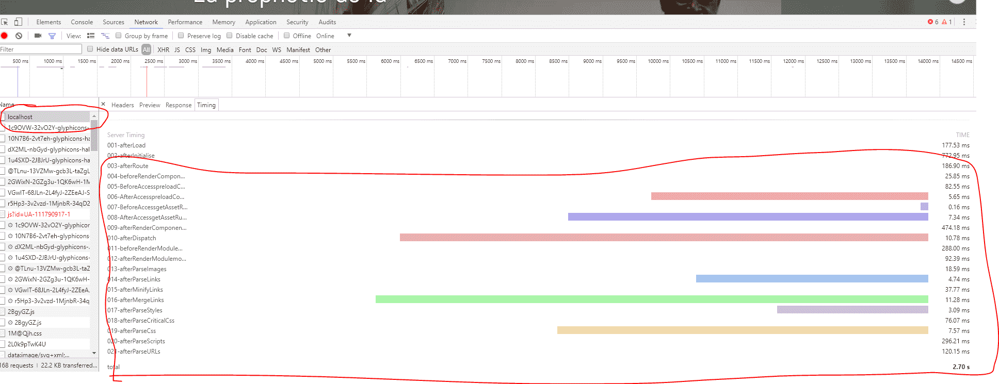

HTML(5) Server Timing API
------------------------------
# HTML(5) Server Timing API

This Joomla plugin enable Server Timing HTTP headers. See https://w3c.github.io/server-timing/

It help you track performance of your website in the browser console (supported by google chrome)[https://developers.google.com/web/tools/chrome-devtools/network-performance/understanding-resource-timing]

This plugin must run as the last plugin in system group. You need to reorder plugins and put it as the last

You may also like

- [Html minifier](https://github.com/tbela99/html-minifier) plugin
- [Gzip](https://github.com/tbela99/gzip) website optimizer plugin

# How to use it

Use the global Joomla profiler to profile you code

```php

    $profiler = JProfiler::getInstance('Application');

    // profile sections of your code    
    $profiler->mark('afterParseImages');
    $body = Gzip\GZipHelper::parseCss($body, $options);

    $profiler->mark('afterParseCss');
    $body = Gzip\GZipHelper::parseScripts($body, $options);
    
    $profiler->mark('afterParseScripts');
    $body = Gzip\GZipHelper::parseURLs($body, $options);

    $profiler->mark('afterParseURLs');
    
```
Open the google chrome console and navigate to the network tab. Click on your page request. Click the timing tab. You will see the result.


